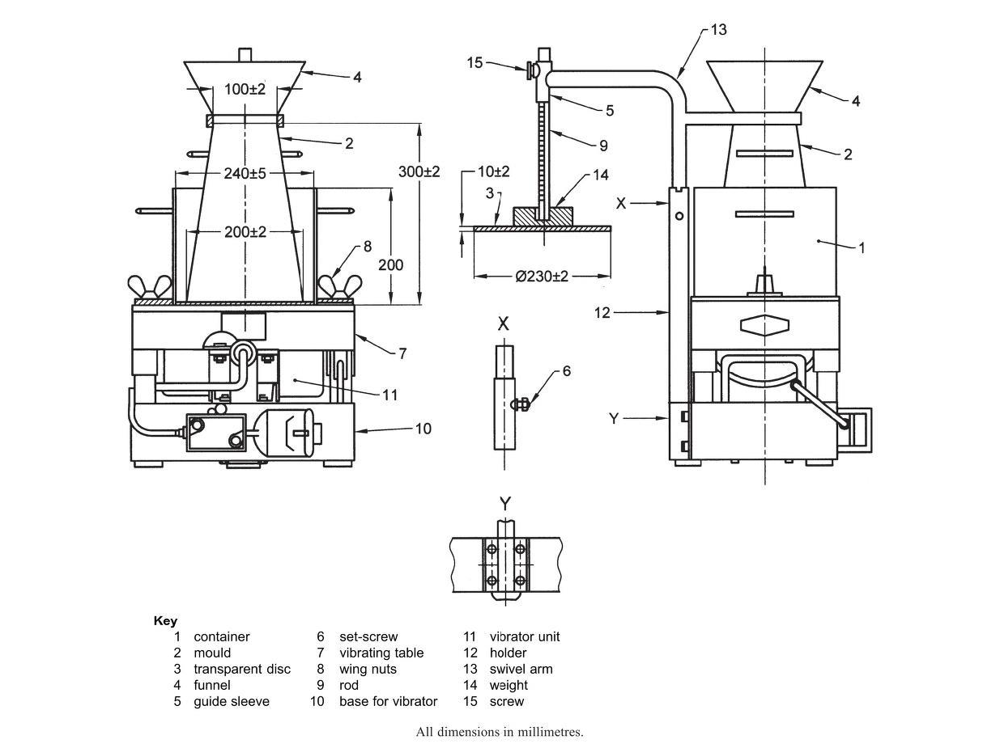

## Theory

As per IS 1199, workability is defined as the property of freshly mixed concrete that determines the ease and homogeneity with which it can be mixed, placed, compacted, and finished. Similarly, ASTM C125 defines workability as the effort required to manipulate a freshly mixed quantity of concrete with minimum loss of homogeneity. The term *manipulate* refers to early-age operations such as placing, compacting, and finishing.

The effort required to place concrete largely depends on the total work needed to initiate and sustain flow. This, in turn, is influenced by:

- The rheological properties of the cement paste (acting as a lubricant),
- Internal friction between aggregate particles, and
- External friction between the concrete and formwork surfaces.

Workability is a critical property in concrete technology as it directly affects constructability. It is a composite characteristic comprising two primary components:

1. **Consistency** – representing ease of flow or mobility, and
2. **Cohesiveness** – indicating stability against segregation and bleeding.

Consistency is commonly measured using the slump cone test or Vee Bee apparatus and serves as a simple index of flowability. The ease of compaction depends on the flow characteristics and the ability to reduce voids without compromising stability under applied pressure.

The Vee-Bee test is a method used to determine the workability of concrete, particularly suitable for stiff mixes with low or very low workability. It operates on the principle of remoulding concrete under vibration, measuring the effort required to change its shape. In this test, the time taken for concrete to remould from a conical shape to a cylindrical shape is called the Vee-Bee time (expressed in seconds), which serves as a quantitative measure of workability. The test provides insight into the mobility and compatibility of concrete by evaluating the relative effort needed for this transformation under controlled vibration conditions. Fresh concrete is first compacted into a slump mould, after which the mould is carefully lifted. A transparent disc is then placed on top of the concrete, and vibration is applied using a vibrating table. The time required for the concrete to fully remould such that the lower surface of the disc is completely in contact with the cement paste is recorded as the Vee-Bee time. Lower time indicates higher workability, while higher time indicates lower workability. Typically, a Vee-Bee time of 0–5 seconds indicates very high workability, 5–10 seconds indicates high workability, 10–20 seconds indicates medium workability, 20–30 seconds indicates low workability, and greater than 30 seconds indicates very low workability. This method is applicable to both wet and dry concrete; however, it is more meaningful for mixes with low consistency, as high-workability concrete remoulds too quickly for accurate measurement. Additionally, the test is advantageous because it simulates field conditions where vibration is used for compaction. However, if the Vee-Bee time is less than 5 seconds or greater than 30 seconds, the test may not be suitable, and alternative methods should be considered.

### Apparatus

The Vee-Bee consistometer (as shown in Fig 1) consists of several components designed to measure the workability of stiff concrete mixes. It includes a cylindrical container made of metal resistant to cement paste, having an internal diameter of 240 ± 5 mm and a height of 200 ± 2 mm, with adequate wall and base thickness to ensure rigidity and watertightness; it is fitted with handles and clamps securely onto the vibrating table. A slump mould, similar to that used in the slump test, is placed concentrically inside the container and must be clean and free from damage before use. A transparent disc, attached to a vertically sliding rod mounted on a swivel arm, is positioned over the concrete; the disc has a diameter of 230 ± 2 mm and, along with the rod and added weight, forms an assembly of mass 2750 ± 50 g. The rod is graduated to measure slump. The setup also includes a vibrating table of size 380 × 260 mm supported on rubber shock absorbers, with a vibrator operating at a frequency of 55 ± 5.5 Hz and producing a vertical amplitude of about 0.5 ± 0.02 mm; the system is periodically checked to maintain accuracy.

Additional accessories include a tamping rod (16 ± 1 mm diameter and 600 ± 5 mm long with rounded ends) for compaction and a stopwatch capable of measuring time to an accuracy of 1 second. Together, these components enable controlled vibration and precise measurement of remoulding time in the Vee-Bee test.

<!-- Image placeholder for Fig. 1: Vee Bee Consistometer -->

**Fig 1. Vee Bee Consistometer (IS 1199: 2018)**

